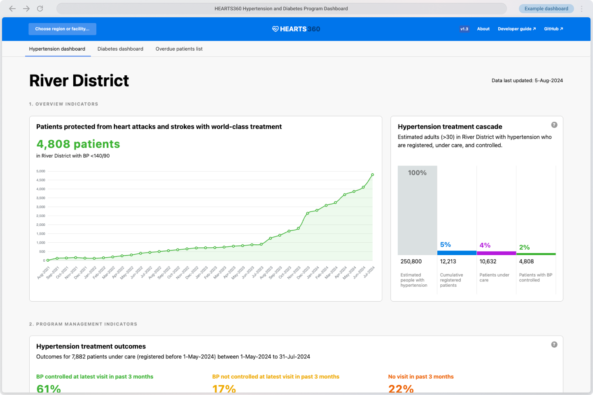

# HEARTS360

[Hearts360.org](https://hearts360.org)

## About

This dashboard is a template that can be used by any team working on a hypertension control project. Our team has learned many lessons while developing the [Simple.org](https://simple.org/) project and we want to share our best practices with the world. A similar dashboard has been used in India, Bangladesh, Sri Lanka, Ethiopia, and Nigeria to successfully manage over 4 million patients with hypertension.

Please feel free to copy any of the code or ideas that you see in this hypertension dashboard (see [open source license](https://github.com/simpledotorg/hypertension-dashboard#license) open source license below).

## See a live example

[View a live example](https://simpledotorg.github.io/hypertension-dashboard/)

## Data & definitions

### Basic Data

A very good public health hypertension dashboard only requires a small number of longitudinal patient data as building blocks:

- `Enrolled patients diagnosed with hypertension` with `Enrollment date` and `Enrollment facility`
- `Patients who had a BP measure in the last 3 months` and was the BP measure ≥140/90 or <140/90?
- `Patients who had a BP measure in the last 12 months`
- `Patient status as living or died`

### Useful Data

Data that shows how much of a region's population has lowered blood pressure is also very helpful. If a region does public health surveys, including the `Estimated population with hypertension` allows you to easily report coverage metrics.

### Inventory data

Adding data on drug stock and functioning BP devices helps round out the dashboard to make it even more useful.

## Developer documentation

Refer to the [developer guide](/developers.html) detailed instruction (with examples) on how to implement HEARTS360 in your own software system.

## License

The generic dashboard is licensed under an MIT License. Please take this code and use it for your own project in any way.

Copyright 2023 Resolve to Save Lives

Permission is hereby granted, free of charge, to any person obtaining a copy of this software and associated documentation files (the “Software”), to deal in the Software without restriction, including without limitation the rights to use, copy, modify, merge, publish, distribute, sublicense, and/or sell copies of the Software, and to permit persons to whom the Software is furnished to do so, subject to the following conditions:

The above copyright notice and this permission notice shall be included in all copies or substantial portions of the Software.

THE SOFTWARE IS PROVIDED “AS IS”, WITHOUT WARRANTY OF ANY KIND, EXPRESS OR IMPLIED, INCLUDING BUT NOT LIMITED TO THE WARRANTIES OF MERCHANTABILITY, FITNESS FOR A PARTICULAR PURPOSE AND NONINFRINGEMENT. IN NO EVENT SHALL THE AUTHORS OR COPYRIGHT HOLDERS BE LIABLE FOR ANY CLAIM, DAMAGES OR OTHER LIABILITY, WHETHER IN AN ACTION OF CONTRACT, TORT OR OTHERWISE, ARISING FROM, OUT OF OR IN CONNECTION WITH THE SOFTWARE OR THE USE OR OTHER DEALINGS IN THE SOFTWARE.
