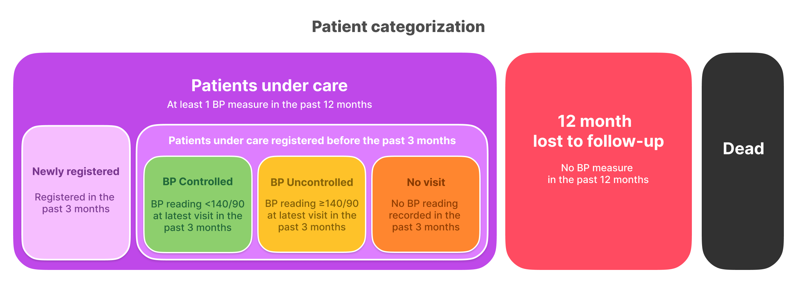

# Guidelines for digital systems managing non-communicable disease programs <!-- omit in toc -->

EHRs that factor in the following key features can be used by program managers to monitor large-scale non-communicable disease (NCD) programs and are optimized for use in busy primary care facilities that manage thousands of patients with hypertension and diabetes. These conditions require long-term monitoring, team-based care, and data-driven decision-making — which a good EHR can support.

Most of the key features of EHRs for managing NCD programs effectively are essential for the management of patients in other health programs in primary care (e.g. in an immunisation program, a list of overdue children who missed a vaccination appointment).

📄 [Download the 1-pager summary](https://docs.google.com/document/d/1yV35dgjnnyYvqNZDXQdQjkZrOVuQ57iMI2QoFHFT7rQ/edit?tab=t.0#heading=h.op6l78a503vp)

---

## 🔑 Key Features for EHRs for Hypertension and Diabetes <!-- omit in toc -->

1. **[Data for quality improvement using WHO indicators / HEARTS360 Dashboard](#data-for-quality-improvement-using-who-indicators--hearts360-dashboard)**
2. **[Overdue patient line lists](#overdue-patient-line-lists)**
3. **[Longitudinal patient records](#longitudinal-patient-records)**
4. **[Consistent patient ID](#consistent-patient-id)**
5. **[Clear patient diagnosis](#clear-patient-diagnosis)**
6. **[Patients “assigned” to a facility](#patients-assigned-to-a-facility)**
7. **[Usability for healthcare workers](#usability-for-healthcare-workers)**
8. **[Custom report generation](#custom-report-generation)**

---

## Data for quality improvement using WHO indicators / HEARTS360 Dashboard

[Hearts360.org](https://hearts360.org)

[](https://simpledotorg.github.io/hearts360/)

This dashboard is a template that can be used by any team working on a hypertension control project. Our team has learned many lessons while developing the [Simple.org](https://simple.org/) project and we want to share our best practices with the world. A similar dashboard has been used in India, Bangladesh, Sri Lanka, Ethiopia, and Nigeria to successfully manage over 4 million patients with hypertension.

Please feel free to copy any of the code or ideas that you see in this hypertension dashboard (see [open source license](#license) open source license below).

📺 [View a live example](https://hearts360.org)

---

## Overdue patient line lists

Get patients to return to care by creating automated line lists of patients that have missed their scheduled follow-up visit and include their phone numbers. Collecting patient consent during registration to call or send reminder messages is important.

💡 Reach out to patients overdue for immunisation or antenatal care appointments.

📄 [Link to PRD](https://docs.google.com/document/d/1ThPhq6Wf6WtxQX3NCB_5s9X15ySJw4-ZMh03RzIma4Y/edit?usp=sharing)

---

## Longitudinal patient records

Maintain a single patient record across multiple visits. At each follow-up, record only a minimum dataset—blood pressure, blood glucose, medications and follow-up appointment date. This data is sufficient to manage patients over time and monitor a large program. 

💡 Scheduling follow-up appointments by default is useful to monitor follow-up care for antenatal care, tuberculosis, immunisation and other health programs.

📄 [Link to PRD](https://docs.google.com/document/d/1JmH3y-6Q2VG-IHpEA2QnlUMivWGpN0ceJziM7LyYtwQ/edit?usp=sharing)

---

## Consistent patient ID

Use a consistent patient ID, National Health ID, to identify and track a patient across facilities. At a minimum, within the same software system, the patient has a single longitudinal health record that follows the patient regardless where they seek care. 

💡 Useful for all health programs for managing a person’s health from young to elderly.

📄 PRD coming soon

---

## Clear patient diagnosis

To help with patient management; differentiate between patients diagnosed with hypertension from those screened with an elevated BP reading (e.g. specific ICD-10 codes). This enables program managers to trust the data and effectively monitor hypertension indicators (e.g. BP controlled monitoring for patients diagnosed with hypertension).

💡 Infectious disease programs can distinguish between suspected and confirmed cases.

📄 [Link to PRD](https://docs.google.com/document/d/1JmH3y-6Q2VG-IHpEA2QnlUMivWGpN0ceJziM7LyYtwQ/edit?usp=sharing)

---

## Patients “assigned” to a facility

Assign each patient to a primary facility responsible for their ongoing care, even if they receive services at other facilities. For example, a patient may register at a district hospital but later visit a community clinic. These visits should be linked to the same patient record to ensure continuity of care.

💡 Useful to monitor a patient’s immunisation, maternal health, infectious disease treatment.

📄 PRD coming soon

---

## Usability for healthcare workers 

EHRs must be fast and simple to use during clinical care. A healthcare worker should be able to enrol a new Hypertension patient in under 90 seconds and record a follow-up visit in under 45 seconds. Longitudinal health records (incl. BP history and medications) should be accessible from the main patient profile.

💡 EHRs that are fast and easy to use during clinical care improves program outcomes.

📄 PRD coming soon

---

## Custom report generation

EHRs that support custom reports are useful to drive further insights from the dashboard. Reports that can be downloaded in a simple format helps program managers to assess trends.

💡 Helps managers spot trends and respond quickly.

📄 PRD coming soon

---

## Data & definitions <!-- omit in toc -->

### Basic Data <!-- omit in toc -->

A very good public health hypertension dashboard only requires a small number of longitudinal patient data as building blocks:

- `Enrolled patients diagnosed with hypertension` with `Enrollment date` and `Enrollment facility`
- `Patients who had a BP measure in the last 3 months` and was the BP measure ≥140/90 or <140/90?
- `Patients who had a BP measure in the last 12 months`
- `Patient status as living or died`

### Useful Data <!-- omit in toc -->

Data that shows how much of a region's population has lowered blood pressure is also very helpful. If a region does public health surveys, including the `Estimated population with hypertension` allows you to easily report coverage metrics.

### Inventory data <!-- omit in toc -->

Adding data on drug stock and functioning BP devices helps round out the dashboard to make it even more useful.

### Overdue patient data

30-60% of patients miss their scheduled visits each month. Including scheduled appointment data helps track patients who did not follow-up and enables patient outreach.

---

# Developer guide<!-- omit in toc -->

This guide explains the how to recreate the [HEARTS360 dashboard](https://hearts360.org) using example database tables and working SQL queries which can be adapted to work with your own archetecture.

## Table of contents <!-- omit in toc -->

- [Patient Categorization](#patient-categorization)
- [Database structure example](#database-structure-example)
  - [Patients table](#patients-table)
  - [BP encounters table](#bp-encounters-table)
- [Example queries (detailed)](#example-queries-detailed)
  - [Cumulative dead patients](#cumulative-dead-patients)
    - [Definition](#definition)
    - [Scenario Example](#scenario-example)
    - [Code Example](#code-example)
    - [Data Example](#data-example)
  - [Cumulative registered patients and monthly registrations](#cumulative-registered-patients-and-monthly-registrations)
    - [Definition](#definition-1)
    - [Scenario Example](#scenario-example-1)
    - [Code Example](#code-example-1)
    - [Data Example](#data-example-1)
  - [Patients under care \& lost to follow-up](#patients-under-care--lost-to-follow-up)
    - [Definition](#definition-2)
    - [Scenario Example](#scenario-example-2)
    - [Code Example](#code-example-2)
    - [Data Example](#data-example-2)
  - [Newly registered / Patients under care registered before the past 3 months ('Controlled BP', 'Uncontrolled BP' \& 'No visit' )](#newly-registered--patients-under-care-registered-before-the-past-3-months-controlled-bp-uncontrolled-bp--no-visit-)
    - [Definition](#definition-3)
    - [Scenario Example](#scenario-example-3)
    - [Code Example](#code-example-3)
    - [Data Example](#data-example-3)
- [Hypertension treatment cascade](#hypertension-treatment-cascade)
- [Additional Dimensions](#additional-dimensions)
- [Caching results](#caching-results)
- [Data Checks](#data-checks)
- [Adapting queries to your data](#adapting-queries-to-your-data)

## Patient Categorization



Patients in the hypertension program are categorized as one of the following:

- Under care
- 12 month lost to follow up
- Dead

Patients marked ‘under care’ fall into one of the 4 following additional categories:

- Newly registered - this category is not visualized in the dashboard
- BP controlled
- BP uncontrolled
- No visit

Depending on the month, a patient may fall under different categories. For example:

- A patient registered in January 2024, is considered Newly Registered for the first 3 months from registration date and from April 2024 moves into either the BP controlled, BP uncontrolled or No Visit category
- Patients under care that have a visit recorded in the past 3 months will be in the BP Controlled or BP Uncontrolled category (depending on their BP reading)
- A patient that does not have a visit recorded in the past 12 months will move to the 12 month lost to follow-up category (up until the 12 month mark, the patient will be recorded in the No Visit category)

As a result, the notion of a REFERENCE MONTH is important for crafting the queries required to get accurate information for each month to build the hypertension treatment indicators.

All elements related to time, should be computed from the perspective of the REFERENCE MONTH and not the current date. This is critically important for information such as:

- Number of BP encounters in the past 3 months
- Number of BP encounters in the past 12 months
- Most recent BP value in the past 3 months

We consider it a good practice to chart the past 18 months of data with the most recent month being the current month.

> [!IMPORTANT]
> All indicators listed in this document are computed as monthly values.
>
> For completed months, the monthly value is based on the end of the month. For the current month, the monthly value is updated throughout the course of the month (e.g. daily if materialized views are refreshed daily).

## Database structure example

This example corresponds to the minimal data set required to reproduce the HEART360 dashboard. It does not correspond to a real life example, as tables are missing important information (name/phone number, table ids …)

Data can be organized differently.

### Patients table

| Column name       | Column type | Possible Values |
| ----------------- | ----------- | --------------- |
| patient_id        | number      |                 |
| patient_status    |             | DEAD, ALIVE     |
| registration_date | date        |                 |
| death_date        | date        |                 |
| facility          |             |                 |
| region            |             |                 |

### BP encounters table

| Column name    | Column type | Possible Values                            |
| -------------- | ----------- | ------------------------------------------ |
| encounter_id   | number      |                                            |
| patient_id     | number      | References a patient, Can be a Foreign Key |
| encounter_date | date        |                                            |
| diastolic_bp   | number      |                                            |
| systolic_bp    | number      |                                            |

## Example queries (detailed)

> [!NOTE]
> Example queries in this document does not take facility/region/state into account. Refer to [Additional Dimensions](#additional-dimensions) setion below on how to modify these queries for facilities, region, state.

### Cumulative dead patients

#### Definition

Cumulative number of dead patients at the end of each month (including patients that have died in previous months).

This should be implemented as a flag during the data collection process where users are allowed to indicate when a patient is deceased. This flag allows dead patients to be excluded from indicators.
All historic data of dead patients is excluded from figures.

> [!TIP]
> This indicator is cumulative and should increase over time.

#### Scenario Example

A patient was registered Sep-2023, and marked dead on Jan-2024. This patient is included in figures Sep-Jan. From the moment they are marked dead all data will be excluded. This patient will no longer be included in any figures for Sep-Jan.

#### Code Example

```SQL
WITH DEAD_PATIENTS_BY_MONTH AS (
    SELECT
        DATE_TRUNC('month',DEATH_DATE) AS REF_MONTH,
        count(\*) AS NB_DEAD_PATIENTS_THAT_MONTH
    FROM patients
    WHERE PATIENT_STATUS = 'dead'
    GROUP BY DATE_TRUNC('month',DEATH_DATE)
)
SELECT
    REFERENCE.REF_MONTH,
    SUM(REFERENCE_BEFORE.NB_DEAD_PATIENTS_THAT_MONTH) AS CUMULATIVE_NUMBER_OF_DEAD_PATIENTS
FROM DEAD_PATIENTS_BY_MONTH REFERENCE
JOIN DEAD_PATIENTS_BY_MONTH REFERENCE_BEFORE ON REFERENCE.REF_MONTH >= REFERENCE_BEFORE.REF_MONTH
GROUP BY REFERENCE.REF_MONTH
ORDER BY REFERENCE.REF_MONTH DESC
```

#### Data Example

| ref_month  | cumulative_number_of_dead_patients |
| ---------- | ---------------------------------- |
| 2024-06-01 | 95                                 |
| 2024-05-01 | 87                                 |
| 2024-04-01 | 80                                 |
| 2024-03-01 | 76                                 |
| 2024-02-01 | 64                                 |
| 2024-01-01 | 60                                 |
| 2023-12-01 | 49                                 |
| 2023-11-01 | 45                                 |
| 2023-10-01 | 42                                 |
| 2023-09-01 | 40                                 |
| 2023-08-01 | 35                                 |
| 2023-07-01 | 30                                 |
| 2023-06-01 | 28                                 |

### Cumulative registered patients and monthly registrations

#### Definition

**Monthly registrations** at the end of each month are the patients registered during the month.

**Cumulative registered patients** at the end of each month are the total number of patients registered before the end of the month and are not **dead**.

> [!TIP]
> This number should be growing with time. More recent months should have a greater number than older months.

#### Scenario Example

A patient was registered Sep-2023, this patient is counted as a monthly registration for Sep-2023. For cumulative registrations, the patient is counted for Sep-2023 and for every subsequent month as long as they are not marked as dead.

#### Code Example

```SQL
WITH
KNOWN_MONTHS AS (
    SELECT
        DISTINCT(DATE_TRUNC('month',REGISTRATION_DATE)) AS REF_MONTH
    FROM patients
),
PATIENTS_BY_MONTH AS (
    SELECT
        DATE_TRUNC('month',created_at) AS REF_MONTH,
        count(\*) AS NB_NEW_PATIENTS
    FROM patients
    WHERE STATUS <> 'dead'
    GROUP BY DATE_TRUNC('month',created_at)
)
SELECT
    KNOWN_MONTHS.REF_MONTH,
    sum(REFERENCE_BEFORE.NB_NEW_PATIENTS) AS CUMULATIVE_NUMBER_OF_PATIENTS,
    sum(case when KNOWN_MONTHS.REF_MONTH = REFERENCE_BEFORE.REF_MONTH then NB_NEW_PATIENTS else null end) AS NB_NEW_PATIENTS
FROM KNOWN_MONTHS
JOIN PATIENTS_BY_MONTH REFERENCE_BEFORE ON KNOWN_MONTHS.REF_MONTH >= REFERENCE_BEFORE.REF_MONTH
GROUP BY KNOWN_MONTHS.REF_MONTH
ORDER BY KNOWN_MONTHS.REF_MONTH DESC
```

##### Subqueries detail <!-- omit in toc -->

`KNOWN_MONTHS`

This is a list of months known by the system. It can be obtained in a variety of ways, but can be derived from the months explicitly existing in the Database as in the example.

`ALIVE_PATIENTS`

This is a list of all patients that are alive. We are limiting our subquery to the columns that are relevant for this aggregation. Registration date is rounded by month as we’re doing a monthly analysis.

#### Data Example

| ref_month  | cumulative_number_of_patients | nb_new_patients |
| ---------- | ----------------------------- | --------------- |
| 2024-06-01 | 41151                         | 2777            |
| 2024-05-01 | 38374 :large_blue_circle:     | 5288            |
| 2024-04-01 | 33086                         | 5921            |
| 2024-03-01 | 27165                         | 5338            |
| 2024-02-01 | 21827                         | 2630            |
| 2024-01-01 | 19197                         | 1755            |
| 2023-12-01 | 17442                         | 1132            |
| 2023-11-01 | 16310                         | 1348            |
| 2023-10-01 | 14962                         | 1844            |
| 2023-09-01 | 13118                         | 1048            |
| 2023-08-01 | 12070                         | 979             |
| 2023-07-01 | 11091                         | 1176            |
| 2023-06-01 | 9915                          | 1542            |
| 2023-05-01 | 8373                          | 1545            |

### Patients under care & lost to follow-up

#### Definition

A patient that is not **Dead** is either **Under care** or **lost to follow-up** for a given reference month:

- **Under care** is a patient with at least one visit recorded in the past 12 months before the end of the reference month
- **Lost to follow-up** is a patient with no visit recorded in the past 12 months before the end of the reference month

As these two indicators are mutually exclusive (the total of _**patients under care**_ and patients _**lost to follow-up**_ should equal _**cumulative registrations**_), it can be calculated in a single query.

> [!IMPORTANT]
>
> **Before the end of the reference month**: _This means the last day of the month is always referenced even when that date is in the future and has not yet occurred. For example if today is 10-Jun-2024, the end of the reference month is 30-Jun-2024, so checking for an event in the past 12 months includes events that occurred between 1-Jul-2023 and 30-Jun-2024._

#### Scenario Example

A patient was registered in Jan-2023, and visited once in Mar-2023. Today is Feb-**2024**. This patient is counted as a _**patient under care**_ as they had a visit in the past 12 months.

Using the same patient, today is Mar-**2024**. This patient is counted as _**lost to follow-up**_ because they have no visit in the past 12 months.

#### Code Example

```SQL
WITH
KNOWN_MONTHS AS (
    SELECT
        DISTINCT(DATE_TRUNC('month',REGISTRATION_DATE)) AS REF_MONTH
    FROM patients
),
ALIVE_PATIENTS AS (
    SELECT
        DATE_TRUNC('month',REGISTRATION_DATE) AS REGISTRATION_MONTH,
        patient_id
    FROM patients
    WHERE PATIENT_STATUS <> 'dead'
),
BP_ENCOUNTERS AS (
    SELECT
        patient_id,
        DATE_TRUNC('month',ENCOUNTER_DATE) AS BP_ENCOUNTER_MONTH
    FROM blood_pressures
)
SELECT
    KNOWN_MONTHS.REF_MONTH,
    sum(CASE WHEN BP_ENCOUNTERS.patient_id IS NULL THEN 1 ELSE NULL END ) AS NB_PATIENTS_LOST_TO_FOLLOW_UP,
    count(DISTINCT(BP_ENCOUNTERS.patient_id)) AS NB_PATIENTS_UNDER_CARE,
    count(DISTINCT(ALIVE_PATIENTS.patient_id)) AS CUMULATIVE_NUMBER_OF_PATIENTS
FROM KNOWN_MONTHS
JOIN ALIVE_PATIENTS
    ON ALIVE_PATIENTS.REGISTRATION_MONTH <= KNOWN_MONTHS.REF_MONTH
LEFT OUTER JOIN BP_ENCOUNTERS
    ON BP_ENCOUNTERS.patient_id = ALIVE_PATIENTS.patient_id
        AND BP_ENCOUNTER_MONTH <= KNOWN_MONTHS.REF_MONTH
        AND BP_ENCOUNTER_MONTH + interval '12 month'> KNOWN_MONTHS.REF_MONTH
GROUP BY KNOWN_MONTHS.REF_MONTH
ORDER BY KNOWN_MONTHS.REF_MONTH DESC;
```

##### Subqueries detail <!-- omit in toc -->

`KNOWN_MONTHS`

This is a list of months known by the system. It can be obtained in a variety of ways, but can be derived from the months explicitly existing in the Database as in the example.

`ALIVE_PATIENTS`

This is a list of all patients that are alive. We are limiting our subquery to the columns that is relevant for this aggregation. Registration date is rounded by month as we’re doing a monthly analysis.

`BP_ENCOUNTERS`

This is a list of all BP readings taken for each patient based on the visit month.

#### Data Example

| ref_month  | nb_patients_lost_to_follow_up | nb_patients_under_care | cumulative_number_of_patients |
| ---------- | ----------------------------- | ---------------------- | ----------------------------- |
| 2024-06-01 | 2266                          | 38885                  | 41151                         |
| 2024-05-01 | 1990                          | 36384 :purple_circle:  | 38374 :large_blue_circle:     |
| 2024-04-01 | 1778                          | 31308                  | 33086                         |
| 2024-03-01 | 1492                          | 25673                  | 27165                         |
| 2024-02-01 | 1283                          | 20544                  | 21827                         |
| 2024-01-01 | 1155                          | 18042                  | 19197                         |
| 2023-12-01 | 997                           | 16445                  | 17442                         |
| 2023-11-01 | 918                           | 15392                  | 16310                         |
| 2023-10-01 | 827                           | 14135                  | 14962                         |
| 2023-09-01 | 721                           | 12397                  | 13118                         |
| 2023-08-01 | 619                           | 11451                  | 12070                         |
| 2023-07-01 | 538                           | 10553                  | 11091                         |
| 2023-06-01 | 443                           | 9472                   | 9915                          |
| 2023-05-01 | 362                           | 8011                   | 8373                          |

### Newly registered / Patients under care registered before the past 3 months ('Controlled BP', 'Uncontrolled BP' & 'No visit' )

#### Definition

There are two mutually exclusive categories for Patients Under Care:

- **Newly registered**: Patient registered in the past 3 months (not visualized).
- **Patients under care registered before the past 3 months**: Patients registered before the past 3 months.

> [!NOTE]
> The **Newly registered** category is not visualized in the dashboard.

There are 3 mutually exclusive categories for Patients under care registered before the past 3 months:

- **Controlled BP**: Patient registered before the past 3 months, with a BP reading <140/90 (systolic BP < 140 **`AND`** diastolic BP < 90) recorded at the patient's most recent visit within the past 3 months.
- **Uncontrolled BP**: Patient registered before the past 3 months, with a BP reading >=140/90 (systolic BP >= 140 **`OR`** diastolic BP >= 90) recorded at the patient's most recent visit within the past 3.
- **No visit**: Patient registered before the past 3 months, with no recorded visited in the past 3 months.

#### Scenario Example

##### Controlled BP <!-- omit in toc -->

A patient was registered into the hypertension program in Sep-2023. They visited for blood pressure measures in Nov-2023 (BP controlled), Jan-2024 (BP not controlled), Feb-2024 (BP not controlled) and Mar-2024 (BP controlled).

Today is Apr-2024, this patient has visited twice in the past 3 months (Feb-2024 and Mar-2024) and is categorized in the controlled BP group at their latest visit (Mar-2024).

##### Uncontrolled BP <!-- omit in toc -->

A patient was registered into the hypertension program in Sep-2023. They visited for blood pressure measures in Nov-2023 (BP controlled), Feb-2024 (BP not controlled) and Apr-2024 (BP not controlled). Today is Apr-2024, this patient has visited twice in the past 3 months (Feb-2024 and Apr-2024) and is uncontrolled BP at their latest visit (Apr-2024).

##### No visit <!-- omit in toc -->

A patient was registered into the hypertension program in Sep-2023. They visited for blood pressure measures in Dec-2023 (BP controlled), Jan-2024 (BP not controlled). Today is Apr-2024, this patient had no visit in the past 3 months.

#### Code Example

```SQL
WITH
KNOWN_MONTHS AS (
    SELECT
        DISTINCT(DATE_TRUNC('month',created_at)) AS REF_MONTH
    FROM patients
),
ALIVE_PATIENTS AS (
    SELECT
        DATE_TRUNC('month',created_at) AS REGISTRATION_MONTH,
        id AS patient_id
    FROM patients
    WHERE PATIENT_STATUS <> 'dead'
),
BP_ENCOUNTERS AS (
    SELECT
        id,
        patient_id,
        systolic,
        diastolic,
        created_at  AS BP_ENCOUNTER_DATE,
        DATE_TRUNC('month',created_at)  AS BP_ENCOUNTER_MONTH
    FROM blood_pressures
),
LATEST_BP_BY_MONTH_AND_PATIENT AS (
    WITH MOST_RECENT_BP_ENCOUNTER AS (
        SELECT
            KNOWN_MONTHS.REF_MONTH,
            MOST_RECENT_BP_ENCOUNTER.patient_id,
            MAX(MOST_RECENT_BP_ENCOUNTER.created_at) AS MOST_RECENT_BP_DATE
        FROM blood_pressures MOST_RECENT_BP_ENCOUNTER
        JOIN KNOWN_MONTHS
            ON DATE_TRUNC('month', MOST_RECENT_BP_ENCOUNTER.created_at) <= KNOWN_MONTHS.REF_MONTH
            AND DATE_TRUNC('month',MOST_RECENT_BP_ENCOUNTER.created_at) + interval '12 month'> KNOWN_MONTHS.REF_MONTH
        GROUP BY KNOWN_MONTHS.REF_MONTH, patient_id)
    SELECT
        REF_MONTH, MOST_RECENT_BP_ENCOUNTER.patient_id,
        MAX(systolic) AS systolic,
        MAX(diastolic) AS diastolic,
        MAX(BP_ENCOUNTER_MONTH) AS BP_ENCOUNTER_MONTH
    FROM MOST_RECENT_BP_ENCOUNTER
    JOIN BP_ENCOUNTERS
        ON MOST_RECENT_BP_ENCOUNTER.MOST_RECENT_BP_DATE = BP_ENCOUNTERS.BP_ENCOUNTER_DATE
        AND MOST_RECENT_BP_ENCOUNTER.patient_id = BP_ENCOUNTERS.patient_id
    GROUP BY REF_MONTH, MOST_RECENT_BP_ENCOUNTER.patient_id
)
SELECT
    KNOWN_MONTHS.REF_MONTH,
    COUNT(*) AS NB_PATIENTS_UNDER_CARE,
    SUM(CASE WHEN ALIVE_PATIENTS.REGISTRATION_MONTH + interval '3 month' > KNOWN_MONTHS.REF_MONTH then 1 else 0 end ) AS NB_PATIENTS_NEWLY_REGISTERED,
    SUM(CASE WHEN ALIVE_PATIENTS.REGISTRATION_MONTH + interval '3 month' > KNOWN_MONTHS.REF_MONTH then 0 else 1 end ) AS NB_PATIENTS_UNDER_CARE_REGISTERED_BEFORE_THE_PAST_3_MONTHS,
    SUM(CASE
        WHEN ALIVE_PATIENTS.REGISTRATION_MONTH + interval '3 month' > KNOWN_MONTHS.REF_MONTH then 0
        WHEN LATEST_BP_BY_MONTH_AND_PATIENT.BP_ENCOUNTER_MONTH + interval '3 month' <= KNOWN_MONTHS.REF_MONTH then 1
        ELSE 0 END ) as NB_PATIENTS_NO_VISIT,
    SUM(CASE
        WHEN ALIVE_PATIENTS.REGISTRATION_MONTH + interval '3 month' > KNOWN_MONTHS.REF_MONTH then 0
        WHEN LATEST_BP_BY_MONTH_AND_PATIENT.BP_ENCOUNTER_MONTH + interval '3 month' <= KNOWN_MONTHS.REF_MONTH then 0
        WHEN systolic > 140 OR diastolic > 90 then 1
        ELSE 0 END ) aASs NB_PATIENTS_UNCONTROLLED,
    SUM(CASE
        WHEN ALIVE_PATIENTS.REGISTRATION_MONTH + interval '3 month' > KNOWN_MONTHS.REF_MONTH then 0
        WHEN LATEST_BP_BY_MONTH_AND_PATIENT.BP_ENCOUNTER_MONTH + interval '3 month' <= KNOWN_MONTHS.REF_MONTH then 0
        WHEN systolic > 140 OR diastolic > 90 then 0
        ELSE 1 END ) AS NB_PATIENTS_CONTROLLED
FROM KNOWN_MONTHS
JOIN ALIVE_PATIENTS
    ON ALIVE_PATIENTS.REGISTRATION_MONTH <= KNOWN_MONTHS.REF_MONTH
JOIN LATEST_BP_BY_MONTH_AND_PATIENT
    ON LATEST_BP_BY_MONTH_AND_PATIENT.patient_id = ALIVE_PATIENTS.patient_id
    AND LATEST_BP_BY_MONTH_AND_PATIENT.REF_MONTH = KNOWN_MONTHS.REF_MONTH
GROUP BY KNOWN_MONTHS.REF_MONTH
ORDER BY 1 DESC
```

##### Subqueries detail <!-- omit in toc -->

`KNOWN_MONTHS`

This is a list of months known by the system. It can be obtained in a variety of ways, but can be derived from the months explicitly existing in the Database as in the example.

`ALIVE_PATIENT`

This is a list of all patients that are alive. We are limiting our subquery to the columns that is relevant for this aggregation. Registration date is rounded by month as we’re doing a monthly analysis.

`BP_ENCOUNTERS`

This is a list of all BP readings taken for each patient based on the visit month.

`LATEST_BP_BY_MONTH_AND_PATIENT`

This subquery returns the most recent BP reading for every patient for every Reference Month.

This is done by first taking the date of the latest BP Measurement in the past 12 months from a given Reference Month for a given patient.

```SQL
SELECT
    KNOWN_MONTHS.REF_MONTH,
    MOST_RECENT_BP_ENCOUNTER.patient_id,
    MAX(MOST_RECENT_BP_ENCOUNTER.created_at) AS MOST_RECENT_BP_DATE
FROM blood_pressures MOST_RECENT_BP_ENCOUNTER
JOIN KNOWN_MONTHS
    ON DATE_TRUNC('month', MOST_RECENT_BP_ENCOUNTER.created_at) <= KNOWN_MONTHS.REF_MONTH
    AND DATE_TRUNC('month',MOST_RECENT_BP_ENCOUNTER.created_at) + interval '12 month'> KNOWN_MONTHS.REF_MONTH
GROUP BY KNOWN_MONTHS.REF_MONTH, patient_id
```

Using this result, we join it against BP_ENCOUNTERS to get the information we need.

#### Data Example

| ref_month  | nb_patients_under_care | nb_patients_newly_registered | nb_patients_under_care_registered_before_the_past_3_months | nb_patients_no_visit | nb_patients_uncontrolled | nb_patients_controlled |
| ---------- | ---------------------- | ---------------------------- | ---------------------------------------------------------- | -------------------- | ------------------------ | ---------------------- |
| 2024-06-01 | 38885                  | 13617                        | 25268                                                      | 5262                 | 5121                     | 14885                  |
| 2024-05-01 | 36384 :purple_circle:  | 16058                        | 20326                                                      | 3926                 | 3955                     | 12445 :green_circle:   |
| 2024-04-01 | 31308                  | 13419                        | 17889                                                      | 3590                 | 3205                     | 11094                  |
| 2024-03-01 | 25673                  | 9461                         | 16212                                                      | 3305                 | 2852                     | 10055                  |
| 2024-02-01 | 20544                  | 5389                         | 15155                                                      | 2841                 | 2902                     | 9412                   |
| 2024-01-01 | 18042                  | 4138                         | 13904                                                      | 2369                 | 2653                     | 8882                   |
| 2023-12-01 | 16445                  | 4229                         | 12216                                                      | 1799                 | 2139                     | 8278                   |
| 2023-11-01 | 15392                  | 4136                         | 11256                                                      | 1676                 | 2026                     | 7554                   |
| 2023-10-01 | 14135                  | 3767                         | 10368                                                      | 1492                 | 1888                     | 6988                   |
| 2023-09-01 | 12397                  | 3111                         | 9286                                                       | 1268                 | 1821                     | 6197                   |
| 2023-08-01 | 11451                  | 3604                         | 7847                                                       | 1061                 | 1476                     | 5310                   |
| 2023-07-01 | 10553                  | 4160                         | 6393                                                       | 910                  | 1314                     | 4169                   |
| 2023-06-01 | 9472                   | 3495                         | 5977                                                       | 942                  | 1320                     | 3715                   |
| 2023-05-01 | 8011                   | 2195                         | 5816                                                       | 969                  | 1279                     | 3568                   |

## Hypertension treatment cascade

The treatment cascade gives a view of how many estimated patients with hypertension in the region have been registered into the hypertension program, how many are under treatment for hypertension and, of those under treatment, how many have controlled blood pressure. The cascade should be constructed for the latest completed reference month.

The estimated patients with hypertension in the region can be found from STEPs survey data and entered into the system. The estimated number of people with hypertension cannot be inferred from the database.

\*The values related to these figures are highlight in the previous data example tables with a colored circle:

- Cumulative registrations :large_blue_circle: [[View data example](#data-example-1)] [[View date example 2](#data-example-2)]
- Patients under care :purple_circle: [[View data example](#data-example-2)] [[View data example 2](#data-example-3)]
- Patients with BP controlled :green_circle: [[View data example](#data-example-3) (Scoll right)]

> [!TIP]
> The corresponding values for the month of **May 2024** are highlighted in their respective colors in the data example tables.

## Additional Dimensions

In order to aggregate by region/state, queries can be modified easily to take this in account by adding the correct level of aggregation in:

- Patient subqueries
- Group by clause of the main query

## Caching results

Depending on the size of the different tables, these queries may be too resource intensive to run in real time, each time a user views the HEARTS360 dashboard.

It is a good practice to cache the results and refresh the tables daily. For example, using Materialized Views that refresh once a day. Caching can also be done at application level, or through a variety of other mechanisms.

## Data Checks

After these queries have been adapted to a system, it is a good practice to check that values obtained through the different queries are consistent:

- The same numbers obtained from different queries should be identical:

  - `CUMULATIVE_NUMBER_OF_PATIENTS` should be the same value from the two queries that produce it
  - `NB_PATIENTS_UNDER_CARE` should be the same value from the two queries that produce it

- The following queries should total:

  - `NB_PATIENTS_UNDER_CARE` = `NB_PATIENTS_NEWLY_REGISTERED` + `NB_PATIENTS_CONTROLLED` + `NB_PATIENTS_UNCONTROLLED` + `NB_PATIENTS_NO_VISIT`
  - `NB_PATIENTS_UNDER_CARE_REGISTERED_BEFORE_PAST_3_MONTHS` = `NB_PATIENTS_UNDER_CARE` - `NB_PATIENTS_NEWLY_REGISTERED`
  - `CUMULATIVE_NUMBER_OF_PATIENTS` = `NB_PATIENTS_LOST_TO_FOLLOW_UP` + `NB_PATIENTS_UNDER_CARE`

- Cumulative indicators should increase over time:

  - Cumulative number of dead patients
  - Cumulative number of registered patients

- Month to month verification
  - `NB_PATIENTS_NEWLY_REGISTERED` of month X = (`CUMULATIVE_NUMBER_OF_PATIENTS` of month X) - (`CUMULATIVE_NUMBER_OF_PATIENTS` of month X -3)

## Adapting queries to your data

If your **PATIENTS** and **EVENTS** tables are structured similar to the database example, it should be possible to adapt the queries by changing only the subqueries.

This is the easiest way to produce valid queries that will work for your data.

---

## License <!-- omit in toc -->

The generic dashboard is licensed under an MIT License. Please take this code and use it for your own project in any way.

Copyright 2023 Resolve to Save Lives

Permission is hereby granted, free of charge, to any person obtaining a copy of this software and associated documentation files (the “Software”), to deal in the Software without restriction, including without limitation the rights to use, copy, modify, merge, publish, distribute, sublicense, and/or sell copies of the Software, and to permit persons to whom the Software is furnished to do so, subject to the following conditions:

The above copyright notice and this permission notice shall be included in all copies or substantial portions of the Software.

THE SOFTWARE IS PROVIDED “AS IS”, WITHOUT WARRANTY OF ANY KIND, EXPRESS OR IMPLIED, INCLUDING BUT NOT LIMITED TO THE WARRANTIES OF MERCHANTABILITY, FITNESS FOR A PARTICULAR PURPOSE AND NONINFRINGEMENT. IN NO EVENT SHALL THE AUTHORS OR COPYRIGHT HOLDERS BE LIABLE FOR ANY CLAIM, DAMAGES OR OTHER LIABILITY, WHETHER IN AN ACTION OF CONTRACT, TORT OR OTHERWISE, ARISING FROM, OUT OF OR IN CONNECTION WITH THE SOFTWARE OR THE USE OR OTHER DEALINGS IN THE SOFTWARE.
